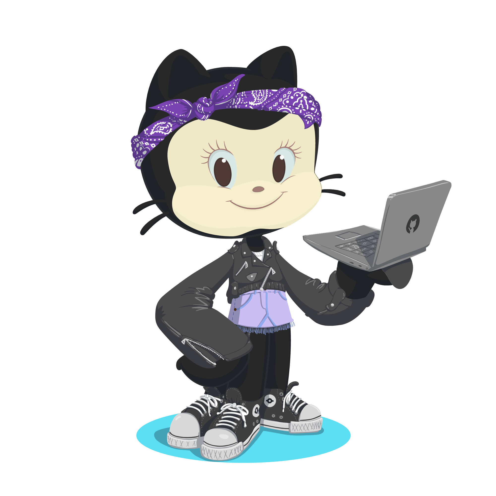

 

### Olá, eu sou a Kauanny 👋
🌱 Sou uma estudante do 3º ano do ensino médio integrado ao técnico de desenvolvimento de sistemas. 
   

##

  <a href="https://github.com/KakauFelix">
  
  

##

 
  
  
  
  
  
  
  
  
  
  

##

  
  
  
  

<!-- 
**KakauFelix/KakauFelix** is a ✨ _special_ ✨ repository because its `README.md` (this file) appears on your GitHub profile.

Here are some ideas to get you started:

- 🔭 I’m currently working on ...
- 🌱 I’m currently learning ...
- 👯 I’m looking to collaborate on ...
- 🤔 I’m looking for help with ...
- 💬 Ask me about ...
- 📫 How to reach me: ...
- 😄 Pronouns: ...
- ⚡ Fun fact: ...
- 🚀 ...
-->
